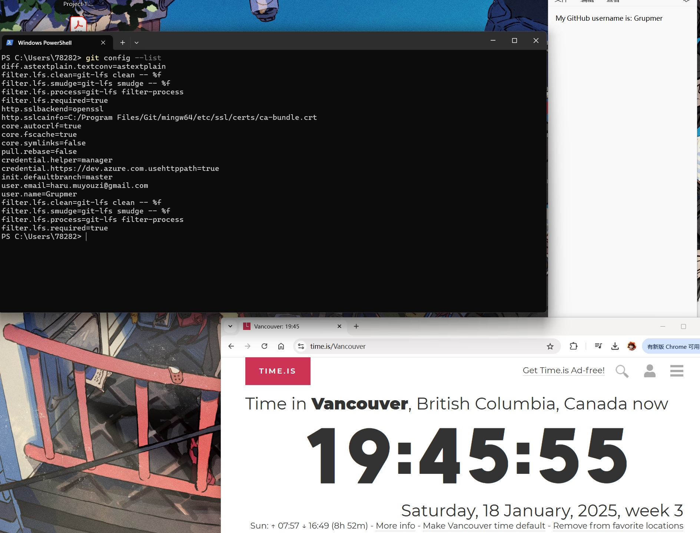

# Lab 1 (25 marks)

[View Lab Instructions Here](L1.md)

[How to use Github / How to submit](https://parsa-rajabi.github.io/CS-5500/#/labs?id=github-classroom)

For this lab, you will include all of your "answers" in this README file. Make sure to cite any sources you use. 

Reminder, this is the syntax to include an image in a markdown (`.md`) file:
```markdown


Example - if a file called test.png was located in this folder:

```

## Task 0: Declare your AI Usage

After you completed this lab, make sure to submit the AI declaration form via MS Form and also upload a PDF copy of your responses to this repository and include the link to PDF in this README file. Note, you must submit this form regardless if you use AI or not. Failure to submit this form will be considered a violation of AI course policy. More details about the AI-usage course policy can be found [here](https://parsa-rajabi.github.io/CS-5500/#/ai-policy).

[Link to AI Usage Disclosure MS Form](/L1_AI_Declaration_Jinzhao_Li_002842268.pdf)

- You will need to log in with your SFU email to access the form. If you're unsuccessful, try using a different browser or incognito mode. Clearing your cache and cookies may also help.

Name the file in the following format: 

`L#_AI_Declaration_FirstName_LastName_StudentID.pdf`

Example (Lab 3):

`L3_AI_Declaration_Parsa_Rajabi_123456789.pdf`


More detailed submission instructions can be found via the [lab page](https://parsa-rajabi.github.io/CS-5500/#/labs).


## Task 1: Prepare your System (1 mark)

Include screenshots as described in the [Lab 1](L1.md) file.





## Task 2: GitHub Tutorial (24 marks)

Include screenshots as described in the [Lab 1](L1.md) file.


## Task 3: Lab Questions (11 marks)

Include answers as described in the [Lab 1](L1.md) file:

### Q1
Git is a distributed version control system used to track changes in code, collaborate with others, and manage project history. GitHubis a website that provides hosting for Git repositories, along with additional features such as issue tracking, pull requests, and collaboration tools.

Sources:
https://git-scm.com/doc
https://docs.github.com/en/get-started/start-your-journey/hello-world

### Q2
A distributed version control system  allows every developer to have a complete copy of the repository (including its history) on their local machine. This design enables developers to work offline, perform commits locally, and synchronize changes with others when needed.

Sources:
https://about.gitlab.com/topics/version-control/benefits-distributed-version-control-system/

### Q3
Modified: The files have been changed but not commit yet.
Staged: Changes are marked to be included in the next commit.
Committed: changes have added to the Git repository.

### Q4
#### Q4 (i)
Copy of an existing repository and download it to my local machine.

#### Q4 (ii)
Displays the current state of the working directory and other status.

#### Q4 (iii)
Downloads updates from a online repository but doesn't merge to local machine. Unlike git pull, it do updates and merge.

#### Q4 (iv)
Initializes a new Git repository in the current directory.

#### Q4 (v)
Shows the log, like history of commits, commit massage and etc.

### Q5

## Task 4: Video Questions (4 marks)

Include answers as described in the [Lab 1](L1.md) file.

### Q1
The video explains the Software Development Life Cycle (SDLC), which is basically the step-by-step process of building, testing, and maintaining software. There are seven main phases: planning, requirement analysis, design, implementation and coding, testing, deployment, and maintenance. It starts with the customer sharing their idea, and the team turns it into a detailed plan. Then, developers build the app, testers make sure everything works, and finally, it gets released to users. Even after the app goes live, the maintenance phase kicks in to fix issues and add new features, repeating the cycle.


### Q2
SDLC is important because it keeps everything organized and helps teams work together. By following these phases, major problems can be avoided. Like bugs that might let someone access another user’s account. Testing make sure that software works as expected before it reaches users, and the maintenance phase helps keep things running. Overall, SDLC makes sure the project stays on track, delivers high quality results, and can handle future changes or challenges without falling the system.
